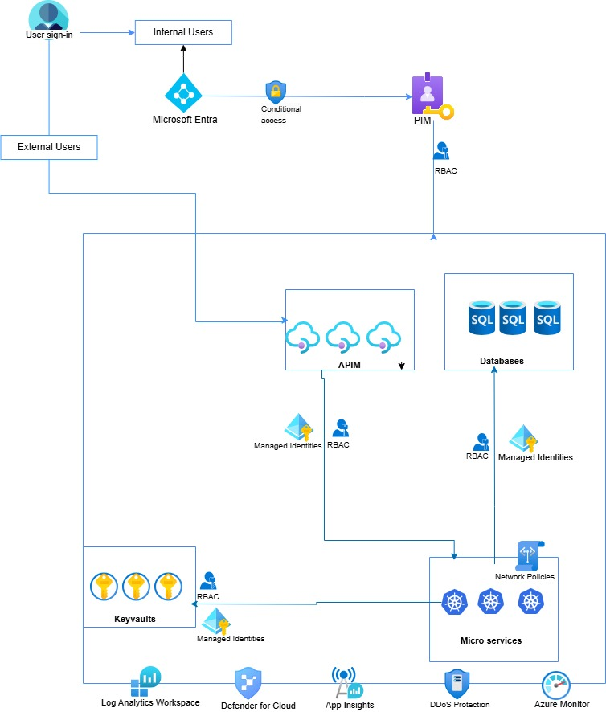

# Secure-Cloud-Architecture

# Secure Cloud Architecture for Azure Web Applications

This project demonstrates a secure cloud-native architecture for hosting web applications in Microsoft Azure. It follows the principles of Zero Trust, least privilege access, and identity-based security using Microsoft’s ecosystem.

##  Architecture Overview

##  Key Components & Security Controls

| Component            | Purpose / Security Function                                         |
|----------------------|---------------------------------------------------------------------|
| **Microsoft Entra**  | Central identity provider with Conditional Access and MFA          |
| **PIM**              | Just-in-time access with role elevation                            |
| **RBAC**             | Role-based access control across all layers                        |
| **Key Vault**        | Secure storage for secrets and credentials                         |
| **Azure APIM**       | API gateway to secure APIs via managed identities and RBAC         |
| **Azure SQL**        | Database with RBAC + Private Link + TDE                            |
| **AKS (Microservices)** | App backend with network policies, RBAC, managed identity         |
| **Log Analytics / Sentinel** | Log aggregation, detection, and response via SIEM             |
| **Defender for Cloud** | Posture management + threat protection across resources            |
| **Azure Monitor & App Insights** | Real-time telemetry and operational monitoring        |
| **DDoS Protection**  | Network-level protection for public-facing services                |

## Tools & Technologies Used

- Microsoft Entra ID (formerly Azure AD)
- Azure PIM (Privileged Identity Management)
- Azure Key Vault
- Azure API Management (APIM)
- Azure Kubernetes Service (AKS)
- Azure SQL Database
- Microsoft Defender for Cloud
- Microsoft Sentinel / Log Analytics
- Azure Monitor / Application Insights

## Security Principles Applied

- ✅ Zero Trust Network Architecture
- ✅ Role-based Access Control (RBAC)
- ✅ Principle of Least Privilege (PIM)
- ✅ Secure Secret Management (Key Vault)
- ✅ Managed Identities
- ✅ Threat Detection and Monitoring

##  Next Steps

- ✅ KQL queries to analyze sign-ins and failed access attempts
- ✅ PowerShell/Bicep to deploy Key Vaults, SQL, or APIM securely
- ✅ Threat modeling doc (`docs/threat_model.md`)

---

##  Use Case

This architecture can be used by any cloud-native application requiring secure access to APIs, databases, and secrets, especially in regulated industries like finance, healthcare, or enterprise SaaS platforms.

## 🪪 License

MIT
