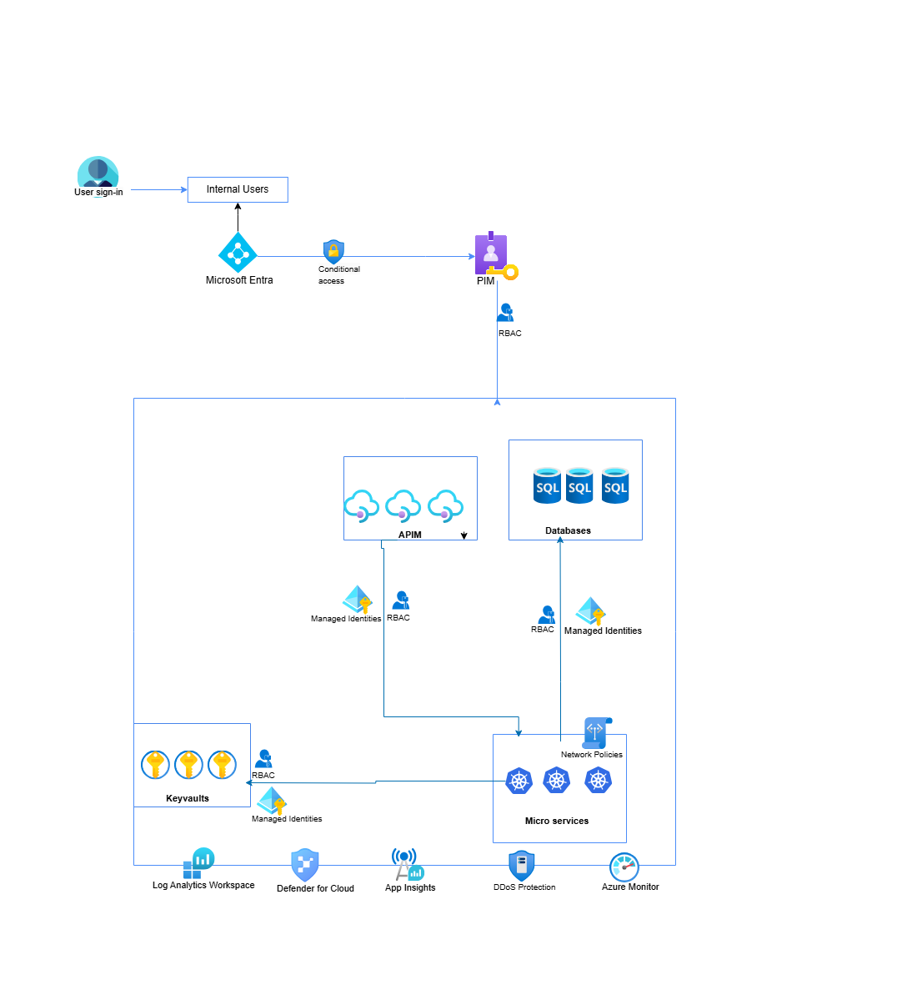

```markdown
# Secure Cloud Architecture for Azure Web Applications

This project demonstrates a secure cloud-native architecture for hosting web applications in Microsoft Azure. It follows the principles of Zero Trust, least privilege access, and identity-based security using Microsoft’s ecosystem.

## 📐 Architecture Overview

Below is an overview of the cloud architecture diagram:



[Download the full diagram here](architecture-diagram/cloud-architecture.png)

---

##  Key Components & Security Controls

| Component                  | Purpose / Security Function                                            |
|---------------------------|------------------------------------------------------------------------|
| **Microsoft Entra**       | Central identity provider with Conditional Access and MFA              |
| **PIM**                   | Just-in-time access with role elevation                                |
| **RBAC**                  | Role-based access control across all layers                            |
| **Key Vault**             | Secure storage for secrets and credentials                             |
| **Azure APIM**            | API gateway to secure APIs via managed identities and RBAC             |
| **Azure SQL**             | Database with RBAC + Private Link + TDE                                |
| **AKS (Microservices)**   | App backend with network policies, RBAC, managed identity              |
| **Log Analytics / Sentinel** | Log aggregation, detection, and response via SIEM                   |
| **Defender for Cloud**    | Posture management + threat protection across resources                |
| **Azure Monitor & App Insights** | Real-time telemetry and operational monitoring                |
| **DDoS Protection**       | Network-level protection for public-facing services                    |

---

##  Tools & Technologies Used

- Microsoft Entra ID (formerly Azure AD)
- Azure PIM (Privileged Identity Management)
- Azure Key Vault
- Azure API Management (APIM)
- Azure Kubernetes Service (AKS)
- Azure SQL Database
- Microsoft Defender for Cloud
- Microsoft Sentinel / Log Analytics
- Azure Monitor / Application Insights

---

##  Security Principles Applied

- ✅ Zero Trust Network Architecture
- ✅ Role-based Access Control (RBAC)
- ✅ Principle of Least Privilege (PIM)
- ✅ Secure Secret Management (Key Vault)
- ✅ Managed Identities
- ✅ Threat Detection and Monitoring

---

##  Project Files & Automation Scripts

All infrastructure-as-code and query files are located in the `scripts/` directory.

###  CLI Scripts (`scripts/CLI-scripts/`)
Shell scripts to provision key services using the Azure CLI:
- `deploy-keyvaults.sh`
- `deploy-sql.sh`
- `deploy-vm.sh`

###  PowerShell Scripts (`scripts/powershell-scripts/`)
PowerShell automation for deploying core infrastructure:
- `deploy-keyvault.ps1`
- `deploy-sql.ps1`
- `deploy-vm.ps1`

###  Terraform Scripts (`scripts/terraform-scripts/`)
Infrastructure as Code templates for reproducible deployments:
- `deploy-keyvaults.tf`
- `deploy-sql.tf`
- `deploy-vm.tf`

###  KQL Queries (`scripts/kql/`)
Log Analytics and Sentinel queries to monitor security events:
- `sign-in-logs.kql` – Monitor successful sign-ins
- `sign-in-failure.kql` – Track failed logins
- `keyvault-access.kql` – Detect abnormal access to secrets
- `rbac-changes.kql` – Watch for changes to role assignments
- `sql-audit-logs.kql` – SQL audit event tracking

---

## Threat Modeling

A dedicated threat modeling document is included as `threat_model.md` to outline risks, mitigations, and trust boundaries based on the architecture.

---

##  Use Case

This architecture can be used by any cloud-native application requiring secure access to APIs, databases, and secrets — particularly in regulated industries like finance, healthcare, or enterprise SaaS platforms.

---

## 📄 License

MIT
```

